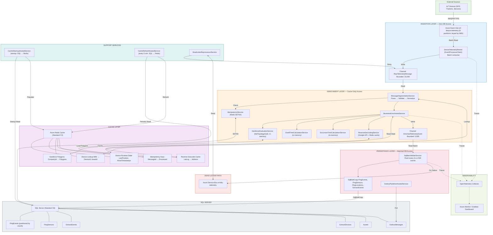

# E4Score Data Ingestion Platform — Architecture Proposal

**Version:** 2.0 | **Date:** April 1, 2026 | **Author:** Solution Architecture Team
**Status:** Draft for Review | **Classification:** Internal — Engineering & Leadership

---

## Table of Contents

1. [Executive Summary](#a-executive-summary)
2. [Proposed Naming Convention](#b-proposed-naming-convention)
3. [Recommended Architecture](#c-recommended-architecture)
4. [Database Optimization Strategy](#d-database-optimization-strategy)
5. [Queue and Messaging Strategy](#e-queue-and-messaging-strategy)
6. [Design Patterns](#f-design-patterns)
7. [.NET 10 Modernization Plan](#g-net-10-modernization-plan)
8. [Architecture Diagram](#h-architecture-diagram)
9. [Build-Start Blueprint](#i-build-start-blueprint)
10. [Risks and Tradeoffs](#j-risks-and-tradeoffs)

---

## A. Executive Summary

The current system processes approximately 1,000 messages per second from IoT devices through Azure Functions triggered by Service Bus queues. Each message triggers **multiple synchronous SQL Server round-trips** — device lookup, asset lookup, geofence evaluation, dwell-time calculation, event insertion, and state updates. At 1,000 msg/s, this creates **5,000–8,000 database calls per second**, which is the root cause of the ~$3,000/month infrastructure cost and the scalability ceiling.

### The Core Architectural Shift

Move from a **per-message database-bound pipeline** to a **buffered, cache-first, batch-persist architecture** where:

1. **Ingestion** accepts messages at wire speed into Event Hubs (no DB touch)
2. **Enrichment** resolves device/asset/geofence data from **Redis cache** (not SQL Server)
3. **Business logic** (dwell time, excursion, geofencing) runs entirely in-memory against cached state
4. **Persistence** happens via **micro-batched bulk inserts** every 1–5 seconds, reducing 5,000 individual writes to ~50 bulk operations per second

### Projected Impact

| Metric | Current | Proposed |
|--------|---------|----------|
| SQL Server calls/sec | 5,000–8,000 | 50–200 |
| SQL Server tier needed | Premium P2+ (~$3,000/mo) | Standard S3 (~$600/mo) |
| Latency per message | 200–500ms | 15–40ms |
| Max throughput | ~1,200 msg/s (ceiling) | 10,000+ msg/s |
| Recovery from failure | Manual investigation | Automatic retry + dead-letter |

---

## B. Proposed Naming Convention

### Naming Philosophy

**Pattern:** `{Domain}.{Layer}.{Component}.{Qualifier}`

### Queue and Topic Names

| Current Name | New Name | Rationale |
|---|---|---|
| Matrack Que trigger | `e4.ingestion.device-telemetry` | Domain-prefixed, describes data content |
| Message Segmentation | `e4.processing.message-segmentation` | Clear pipeline stage |
| deviceProcessingQue | `e4.processing.business-enrichment` | Describes what happens, not implementation |
| (new) | `e4.persistence.batch-writer` | Final persistence stage |
| (new) | `e4.dlq.device-telemetry` | Dead-letter for ingestion |
| (new) | `e4.dlq.business-enrichment` | Dead-letter for processing |

### Service and Worker Names

| Component Type | Naming Convention | Example |
|---|---|---|
| Ingestion Workers | `E4.Ingestion.{Source}Worker` | `E4.Ingestion.DeviceTelemetryWorker` |
| Processing Services | `E4.Processing.{Function}Service` | `E4.Processing.MessageSegmentationService` |
| Business Services | `E4.Business.{Domain}Service` | `E4.Business.GeofenceEvaluationService` |
| Persistence Workers | `E4.Persistence.{Target}Writer` | `E4.Persistence.SqlBatchWriter` |
| Cache Services | `E4.Cache.{Domain}CacheService` | `E4.Cache.DeviceStateCacheService` |
| Background Services | `E4.Host.{Function}HostedService` | `E4.Host.CacheWarmupHostedService` |

### Database Context and Repository Names

| Current | New | Notes |
|---|---|---|
| `ezcheckinContext` | `E4ScorePlatformDbContext` | Primary read/write context |
| (new) | `E4ScoreReadOnlyDbContext` | CQRS read-side context |
| (new) | `E4ScoreBulkOperationsDbContext` | Optimized for bulk insert (no change tracking) |

### Project and Namespace Structure

```
E4Score.Platform.Contracts          → shared DTOs, events, interfaces
E4Score.Platform.Domain             → domain models, business rules
E4Score.Platform.Infrastructure     → SQL Server, Redis, Service Bus clients
E4Score.Platform.Ingestion.Worker   → ingestion hosted service
E4Score.Platform.Processing.Worker  → segmentation + enrichment worker
E4Score.Platform.Persistence.Worker → batch writer worker
E4Score.Platform.Api.Gateway        → API layer (if needed)
E4Score.Platform.Tests.Unit
E4Score.Platform.Tests.Integration
```

---

## C. Recommended Architecture

### End-to-End Ingestion Flow

```
┌─────────────────────────────────────────────────────────────────────────────┐
│                        INGESTION LAYER (Zero DB Access)                     │
│                                                                             │
│  IoT Devices ──► Azure Event Hub ──► DeviceTelemetryWorker                 │
│                  (partitioned       (batch consumer,                        │
│                   by IMEI)           deserialize + validate)               │
└────────────────────────────────────┬────────────────────────────────────────┘
                                 │
                                 ▼
┌─────────────────────────────────────────────────────────────────────────────┐
│                    ENRICHMENT LAYER (Cache-Only DB Access)                  │
│                                                                             │
│  MessageSegmentationService                                                 │
│    ├─ Parse raw payload → DeviceTelemetryEvent                             │
│    ├─ Redis: Resolve IMEI → DeviceId, AssetId, CompanyId                   │
│    ├─ Redis: Load geofence polygons for company                            │
│    └─ Redis: Load device last-known state                                  │
│                                                                             │
│  BusinessEnrichmentService                                                  │
│    ├─ GeofenceEvaluationService (in-memory, NetTopologySuite)              │
│    ├─ DwellTimeCalculationService (in-memory against cached state)         │
│    ├─ ExcursionTimeCalculationService (in-memory)                          │
│    ├─ ReverseGeocodingService (Google API + Redis geo-cache)               │
│    └─ Redis: Update device state (last position, move timestamps)          │
│                                                                             │
│  Output: EnrichedTelemetryEvent → in-memory Channel<T> buffer              │
└────────────────────────────────────┬────────────────────────────────────────┘
                                 │
                                 ▼
┌─────────────────────────────────────────────────────────────────────────────┐
│                    PERSISTENCE LAYER (Batched DB Access)                    │
│                                                                             │
│  SqlBatchWriterService                                                      │
│    ├─ Collects EnrichedTelemetryEvents from Channel<T>                     │
│    ├─ Every 1-5 sec OR every 500 events (whichever first):                 │
│    │    ├─ Bulk insert PingEvents (SqlBulkCopy)                            │
│    │    ├─ Bulk insert PingSensors (SqlBulkCopy)                           │
│    │    ├─ Bulk insert PingLocations (SqlBulkCopy)                         │
│    │    ├─ Bulk upsert EztrackEvents (MERGE statement)                     │
│    │    ├─ Bulk update EztrackDevices (batched UPDATE)                     │
│    │    └─ Bulk update Assets (batched UPDATE)                             │
│    ├─ On success: ACK Event Hub checkpoint                                 │
│    └─ On failure: Retry → Dead-letter queue                                │
└─────────────────────────────────────────────────────────────────────────────┘
```

### Why This Architecture Fits Microsoft/.NET

1. **Event Hubs** is Microsoft's answer to Kafka — built for high-throughput telemetry ingestion, integrated with Azure SDK for .NET, and supports consumer groups and checkpointing natively.

2. **System.Threading.Channels** provides a high-performance, in-process bounded buffer that replaces the need for an intermediate queue between enrichment and persistence. At 1,000 msg/s within a single process, this is faster and cheaper than another Service Bus hop.

3. **SqlBulkCopy** is SQL Server's native bulk insert mechanism — it bypasses the ORM, writes directly to the TDS stream, and can insert 10,000 rows in less than 100ms. This is the single biggest cost reduction lever.

4. **.NET 10 BackgroundService** provides first-class support for long-running workers with proper lifetime management, cancellation token propagation, and health check integration.

### Component Responsibility Matrix

| Component | Touches SQL Server? | Touches Redis? | Touches Event Hub? |
|---|---|---|---|
| `DeviceTelemetryWorker` | No | No | Yes (Read) |
| `MessageSegmentationService` | No | Yes (Read) | No |
| `BusinessEnrichmentService` | No | Yes (Read/Write) | No |
| `SqlBatchWriterService` | Yes (Bulk Write) | No | Yes (Checkpoint) |
| `CacheWarmupHostedService` | Yes (Read at startup) | Yes (Write) | No |
| `CacheRefreshHostedService` | Yes (Read periodic) | Yes (Write) | No |

**Result:** Only 2 out of 6 components ever touch SQL Server, and one of them only runs at startup.

---

## D. Database Optimization Strategy

### Why Repeated Database Hits Are Expensive

The current ProcessDeviceInfo executes this sequence **per message**:

```
Message arrives
  → Query EztrackDevices WHERE IMEI = @imei           (1 DB call)
  → Query EztrackAssets WHERE DeviceId = @id           (1 DB call)
  → Query Locations WHERE CompanyId = @cid             (1 DB call)
  → Query GeofencePolygons WHERE LocationId IN (...)   (1 DB call)
  → Insert PingEvent                                    (1 DB call)
  → Insert PingSensor                                   (1 DB call)
  → Insert PingLocation                                 (1 DB call)
  → Update EztrackDevice (last position)                (1 DB call)
  → Update Asset (status, location)                     (1 DB call)
  → Insert EztrackEvent                                 (1 DB call)
  → SaveChanges()                                       (1 DB call)
```

That is approximately **10 DB round-trips per message × 1,000 msg/s = 10,000 DB operations/second**.

### Optimization: The Three-Layer Cache Model

#### Layer 1: Reference Data Cache (Redis — Read-Heavy, Rarely Changes)

```csharp
public interface IDeviceStateCacheService
{
    // Keyed by IMEI → DeviceId, AssetId, CompanyId, DeviceType
    Task<DeviceCacheEntry?> GetDeviceByImeiAsync(string imei);

    // Keyed by CompanyId → List<GeofencePolygon>
    Task<IReadOnlyList<GeofenceCacheEntry>> GetGeofencesAsync(long companyId);

    // Keyed by LocationId → Location details
    Task<LocationCacheEntry?> GetLocationAsync(long locationId);

    // Keyed by CompanyId → DispatchSettings, DwellTimeThresholds
    Task<CompanySettingsCacheEntry?> GetCompanySettingsAsync(long companyId);
}
```

**Cache warming strategy:**

```csharp
public class CacheWarmupHostedService : BackgroundService
{
    protected override async Task ExecuteAsync(CancellationToken ct)
    {
        var devices = await _dbContext.EztrackDevices
            .AsNoTracking()
            .Where(d => d.IsActive == true)
            .Select(d => new DeviceCacheEntry
            {
                Imei = d.Imei,
                DeviceId = d.Id,
                AssetId = d.AssetId,
                CompanyId = d.CompanyId,
                DeviceType = d.DeviceType
            })
            .ToListAsync(ct);

        var batch = _redis.CreateBatch();
        foreach (var device in devices)
        {
            batch.StringSetAsync(
                $"device:imei:{device.Imei}",
                JsonSerializer.Serialize(device),
                TimeSpan.FromMinutes(10));
        }
        await batch.ExecuteAsync();
    }
}
```

#### Layer 2: Device State Cache (Redis — Write-Heavy, Changes Every Message)

```csharp
public interface IDeviceRuntimeStateCache
{
    // Stores: LastLatitude, LastLongitude, LastEventTime, FirstMoveTime,
    //         LastMoveTime, CurrentGeofenceId, DwellStartTime,
    //         ExcursionStartTime, IsMoving, LastSpeed
    Task<DeviceRuntimeState?> GetStateAsync(string imei);
    Task SetStateAsync(string imei, DeviceRuntimeState state);
}
```

**Key insight:** The current ProcessDeviceInfo reads and writes device state to SQL Server on every message. This state (last position, move timestamps, dwell start) is **transient operational state** — it belongs in Redis, not SQL Server.

#### Layer 3: Write Buffer (Channel T + SqlBulkCopy)

```csharp
public class SqlBatchWriterService : BackgroundService
{
    private readonly Channel<EnrichedTelemetryEvent> _channel;
    private readonly int _batchSize = 500;
    private readonly TimeSpan _flushInterval = TimeSpan.FromSeconds(2);

    protected override async Task ExecuteAsync(CancellationToken ct)
    {
        var buffer = new List<EnrichedTelemetryEvent>(_batchSize);
        await foreach (var item in _channel.Reader.ReadAllAsync(ct))
        {
            buffer.Add(item);
            if (buffer.Count >= _batchSize || !_channel.Reader.TryPeek(out _))
            {
                await FlushAsync(buffer, ct);
                buffer.Clear();
            }
        }
    }

    private async Task FlushAsync(List<EnrichedTelemetryEvent> batch, CancellationToken ct)
    {
        await using var connection = new SqlConnection(_connectionString);
        await connection.OpenAsync(ct);
        await using var transaction = await connection.BeginTransactionAsync(ct);

        try
        {
            await BulkInsertPingEventsAsync(connection, transaction, batch, ct);
            await BulkInsertPingSensorsAsync(connection, transaction, batch, ct);
            await BulkInsertPingLocationsAsync(connection, transaction, batch, ct);
            await BulkInsertEztrackEventsAsync(connection, transaction, batch, ct);
            await BulkUpdateDeviceStatesAsync(connection, transaction, batch, ct);
            await transaction.CommitAsync(ct);
        }
        catch
        {
            await transaction.RollbackAsync(ct);
            throw;
        }
    }
}
```

**Impact: 500 individual INSERTs become 1 SqlBulkCopy call. That is a 500x reduction in SQL Server operations.**

### SQL Server Configuration Recommendations

```sql
-- Table optimizations for high-write telemetry tables
ALTER TABLE PingEvents SET (LOCK_ESCALATION = AUTO);
CREATE CLUSTERED INDEX IX_PingEvents_EventTime ON PingEvents(EventTime DESC);

-- Enable page compression for historical data (60-70% space savings)
ALTER TABLE PingEvents REBUILD WITH (DATA_COMPRESSION = PAGE);

-- Partition PingEvents by month for query performance and archival
CREATE PARTITION FUNCTION PingEventDateRange (datetime2)
AS RANGE RIGHT FOR VALUES (
    '2026-01-01', '2026-02-01', '2026-03-01'
);

-- Use READ_COMMITTED_SNAPSHOT to eliminate read locks
ALTER DATABASE E4ScorePlatform SET READ_COMMITTED_SNAPSHOT ON;
ALTER DATABASE E4ScorePlatform SET ALLOW_SNAPSHOT_ISOLATION ON;
```

---

## E. Queue and Messaging Strategy

### Recommended: Azure Event Hubs for Ingestion + Azure Service Bus for DLQ

| Layer | Technology | Reason |
|---|---|---|
| **Ingestion** (IoT → Platform) | **Azure Event Hubs** | Built for high-throughput telemetry. 1,000 msg/s is trivial. IMEI-based partitioning ensures ordering per device. Cheaper than Service Bus at high volume. |
| **Internal pipeline** (between services) | **System.Threading.Channels** | Since enrichment and persistence run in the same process, an in-memory channel is faster, cheaper, and simpler than an external queue. |
| **Dead-letter / Retry** | **Azure Service Bus** | Native dead-letter queue support, scheduled retry, and message sessions — perfect for poison message handling. |
| **Cross-service events** | **Azure Service Bus Topics** | For future use: when other systems need to react to telemetry events (notifications, analytics, etc.). |

### Why Not Service Bus for Everything?

| Factor | Event Hubs | Service Bus |
|---|---|---|
| Throughput | 1M+ events/sec | ~2,000 msg/sec per queue |
| Pricing model | Per throughput unit (~$11/mo/TU) | Per message (~$0.05/100K ops) |
| At 1,000 msg/s (86.4M/day) | ~$22/mo (2 TUs) | ~$43/mo + premium for speed |
| Partitioning | Built-in (up to 32) | Manual via sessions |
| Replay | Yes (up to 90 days) | No (consumed = gone) |
| Ordering guarantee | Per partition | Per session |

**For IoT telemetry at 1,000+ msg/s, Event Hubs is the clear choice.**

### Event Hub Configuration

```csharp
// Program.cs — Worker Service
builder.Services.AddHostedService<DeviceTelemetryWorker>();

builder.Services.AddSingleton(sp =>
{
    return new EventProcessorClient(
        new BlobContainerClient(
            builder.Configuration["Azure:Storage:ConnectionString"],
            "event-hub-checkpoints"),
        "e4-processing-cg",
        builder.Configuration["Azure:EventHub:ConnectionString"],
        "e4-device-telemetry");
});

// Channel configuration
builder.Services.AddSingleton(Channel.CreateBounded<RawTelemetryMessage>(
    new BoundedChannelOptions(capacity: 10_000)
    {
        FullMode = BoundedChannelFullMode.Wait,
        SingleReader = false,
        SingleWriter = false
    }));

builder.Services.AddSingleton(Channel.CreateBounded<EnrichedTelemetryEvent>(
    new BoundedChannelOptions(capacity: 5_000)
    {
        FullMode = BoundedChannelFullMode.Wait,
        SingleReader = true,
        SingleWriter = false
    }));
```

---

## F. Design Patterns

### 1. Pipeline Pattern (Core Architecture)

The entire system is a pipeline with explicit stages, each with a single responsibility:

```
[Ingestion] ──Channel<Raw>──► [Segmentation] ──Channel<Parsed>──►
[Enrichment] ──Channel<Enriched>──► [Persistence]
```

### 2. Idempotency

IoT devices often resend messages. Event Hubs guarantees at-least-once delivery. We need idempotent processing:

```csharp
public class IdempotencyService
{
    private readonly IConnectionMultiplexer _redis;

    public async Task<bool> TryClaimAsync(string messageId, TimeSpan expiry)
    {
        var db = _redis.GetDatabase();
        return await db.StringSetAsync(
            $"idempotency:{messageId}",
            DateTimeOffset.UtcNow.ToUnixTimeSeconds(),
            expiry,
            When.NotExists);
    }
}

// Usage in segmentation service
public async Task ProcessAsync(RawTelemetryMessage message)
{
    var messageId = $"{message.Imei}:{message.Timestamp.Ticks}";
    if (!await _idempotency.TryClaimAsync(messageId, TimeSpan.FromHours(24)))
    {
        _logger.LogDebug("Duplicate message {MessageId}, skipping", messageId);
        return;
    }
    // Process...
}
```

### 3. Circuit Breaker + Retry with Exponential Backoff

Using Microsoft Polly v8 integration:

```csharp
// For SQL Server writes
builder.Services.AddResiliencePipeline("sql-write", pipeline =>
{
    pipeline
        .AddRetry(new RetryStrategyOptions
        {
            MaxRetryAttempts = 3,
            Delay = TimeSpan.FromMilliseconds(500),
            BackoffType = DelayBackoffType.Exponential,
            ShouldHandle = new PredicateBuilder()
                .Handle<SqlException>(ex => ex.IsTransient)
                .Handle<TimeoutException>()
        })
        .AddCircuitBreaker(new CircuitBreakerStrategyOptions
        {
            FailureRatio = 0.5,
            MinimumThroughput = 10,
            SamplingDuration = TimeSpan.FromSeconds(30),
            BreakDuration = TimeSpan.FromSeconds(15)
        })
        .AddTimeout(TimeSpan.FromSeconds(30));
});

// For Redis reads
builder.Services.AddResiliencePipeline("redis-read", pipeline =>
{
    pipeline
        .AddRetry(new RetryStrategyOptions
        {
            MaxRetryAttempts = 2,
            Delay = TimeSpan.FromMilliseconds(100),
            BackoffType = DelayBackoffType.Constant
        })
        .AddTimeout(TimeSpan.FromSeconds(5));
});
```

### 4. Dead-Letter Queue Pattern

```csharp
public class DeadLetterService
{
    private readonly ServiceBusSender _dlqSender;

    public async Task SendToDeadLetterAsync(
        RawTelemetryMessage message,
        Exception exception,
        int retryCount,
        CancellationToken ct)
    {
        var dlqMessage = new ServiceBusMessage(
            JsonSerializer.SerializeToUtf8Bytes(message))
        {
            Subject = "ProcessingFailure",
            ContentType = "application/json",
            ApplicationProperties =
            {
                ["OriginalImei"] = message.Imei,
                ["FailureReason"] = exception.Message,
                ["ExceptionType"] = exception.GetType().FullName,
                ["RetryCount"] = retryCount,
                ["FailedAt"] = DateTimeOffset.UtcNow.ToString("O"),
                ["OriginalEventTime"] = message.Timestamp.ToString("O")
            },
            ScheduledEnqueueTime = DateTimeOffset.UtcNow.AddMinutes(30)
        };

        await _dlqSender.SendMessageAsync(dlqMessage, ct);
    }
}
```

### 5. Outbox Pattern (For Cross-System Events)

```csharp
private async Task FlushAsync(List<EnrichedTelemetryEvent> batch, CancellationToken ct)
{
    await using var transaction = await connection.BeginTransactionAsync(ct);

    // 1. Bulk insert telemetry data
    await BulkInsertPingEventsAsync(connection, transaction, batch, ct);

    // 2. Insert outbox messages (same transaction)
    var outboxEvents = batch
        .Where(e => e.RequiresNotification)
        .Select(e => new OutboxMessage
        {
            Id = Guid.NewGuid(),
            EventType = "TelemetryProcessed",
            Payload = JsonSerializer.Serialize(e.ToNotificationPayload()),
            CreatedAt = DateTime.UtcNow,
            ProcessedAt = null
        });

    await BulkInsertOutboxAsync(connection, transaction, outboxEvents, ct);
    await transaction.CommitAsync(ct);
}

// Separate background service polls outbox and publishes to Service Bus
public class OutboxPublisherHostedService : BackgroundService
{
    protected override async Task ExecuteAsync(CancellationToken ct)
    {
        while (!ct.IsCancellationRequested)
        {
            var pending = await _dbContext.OutboxMessages
                .Where(m => m.ProcessedAt == null)
                .OrderBy(m => m.CreatedAt)
                .Take(100)
                .ToListAsync(ct);

            foreach (var msg in pending)
            {
                await _serviceBusSender.SendMessageAsync(
                    new ServiceBusMessage(msg.Payload), ct);
                msg.ProcessedAt = DateTime.UtcNow;
            }

            await _dbContext.SaveChangesAsync(ct);
            await Task.Delay(TimeSpan.FromSeconds(5), ct);
        }
    }
}
```

### 6. Bulkhead Isolation

```csharp
builder.Services.AddHostedService<DeviceTelemetryWorker>();        // Core pipeline
builder.Services.AddHostedService<MessageSegmentationWorker>();     // Core pipeline
builder.Services.AddHostedService<BusinessEnrichmentWorker>();      // Core pipeline
builder.Services.AddHostedService<SqlBatchWriterService>();         // Core pipeline
builder.Services.AddHostedService<CacheWarmupHostedService>();      // Support
builder.Services.AddHostedService<CacheRefreshHostedService>();     // Support
builder.Services.AddHostedService<OutboxPublisherHostedService>();  // Support
builder.Services.AddHostedService<DeadLetterReprocessorService>(); // Support
builder.Services.AddHostedService<HealthMonitorService>();          // Observability
```

---

## G. .NET 10 Modernization Plan

### Hosting Model: Worker Service (Not Azure Functions)

**Why move away from Azure Functions?**

The current Functions-based architecture creates a new function invocation per message. At 1,000 msg/s, that is 1,000 cold/warm starts per second, each with its own DI scope, DB connection, and overhead. A **Worker Service** runs as a long-lived process with persistent connections, shared caches, and efficient resource use.

### Program.cs Configuration

```csharp
var builder = Host.CreateApplicationBuilder(args);

// Configuration
builder.Configuration
    .AddJsonFile("appsettings.json", optional: false)
    .AddJsonFile($"appsettings.{builder.Environment.EnvironmentName}.json", optional: true)
    .AddAzureKeyVault(new Uri(builder.Configuration["Azure:KeyVault:Uri"]!),
        new DefaultAzureCredential())
    .AddEnvironmentVariables("E4_");

// Observability
builder.Services.AddOpenTelemetry()
    .WithTracing(tracing => tracing
        .AddSource("E4Score.Ingestion", "E4Score.Processing", "E4Score.Persistence")
        .AddSqlClientInstrumentation(o => o.SetDbStatementForText = true)
        .AddRedisInstrumentation()
        .AddOtlpExporter())
    .WithMetrics(metrics => metrics
        .AddMeter("E4Score.Ingestion", "E4Score.Processing", "E4Score.Persistence")
        .AddRuntimeInstrumentation()
        .AddProcessInstrumentation()
        .AddOtlpExporter());

// Infrastructure
builder.Services.AddSingleton<IConnectionMultiplexer>(sp =>
    ConnectionMultiplexer.Connect(builder.Configuration["Redis:ConnectionString"]!));

builder.Services.AddDbContextFactory<E4ScorePlatformDbContext>(options =>
    options.UseSqlServer(builder.Configuration.GetConnectionString("E4ScorePlatform"),
        sql =>
        {
            sql.CommandTimeout(30);
            sql.EnableRetryOnFailure(3, TimeSpan.FromSeconds(5), null);
            sql.UseQuerySplittingBehavior(QuerySplittingBehavior.SplitQuery);
        })
    .UseQueryTrackingBehavior(QueryTrackingBehavior.NoTracking));

// Channels (In-Process Queues)
builder.Services.AddSingleton(Channel.CreateBounded<RawTelemetryMessage>(
    new BoundedChannelOptions(10_000) { FullMode = BoundedChannelFullMode.Wait }));
builder.Services.AddSingleton(Channel.CreateBounded<EnrichedTelemetryEvent>(
    new BoundedChannelOptions(5_000) { FullMode = BoundedChannelFullMode.Wait }));

// Resilience
builder.Services.AddResiliencePipeline("sql-write", ConfigureSqlResilience);
builder.Services.AddResiliencePipeline("redis-read", ConfigureRedisResilience);

// Application Services
builder.Services.AddSingleton<IDeviceStateCacheService, RedisDeviceStateCacheService>();
builder.Services.AddSingleton<IDeviceRuntimeStateCache, RedisDeviceRuntimeStateCache>();
builder.Services.AddSingleton<IIdempotencyService, RedisIdempotencyService>();
builder.Services.AddSingleton<IGeofenceEvaluationService, GeofenceEvaluationService>();
builder.Services.AddSingleton<IDwellTimeCalculationService, DwellTimeCalculationService>();
builder.Services.AddSingleton<IReverseGeocodingService, GoogleReverseGeocodingService>();
builder.Services.AddSingleton<IDeadLetterService, ServiceBusDeadLetterService>();

// Workers (Pipeline Stages)
builder.Services.AddHostedService<DeviceTelemetryWorker>();
builder.Services.AddHostedService<MessageSegmentationWorker>();
builder.Services.AddHostedService<BusinessEnrichmentWorker>();
builder.Services.AddHostedService<SqlBatchWriterService>();
builder.Services.AddHostedService<CacheWarmupHostedService>();
builder.Services.AddHostedService<CacheRefreshHostedService>();

// Health Checks
builder.Services.AddHealthChecks()
    .AddSqlServer(builder.Configuration.GetConnectionString("E4ScorePlatform")!)
    .AddRedis(builder.Configuration["Redis:ConnectionString"]!)
    .AddAzureEventHub(builder.Configuration["Azure:EventHub:ConnectionString"]!, "e4-device-telemetry")
    .AddCheck<ChannelHealthCheck<RawTelemetryMessage>>("ingestion-channel")
    .AddCheck<ChannelHealthCheck<EnrichedTelemetryEvent>>("persistence-channel");

var host = builder.Build();
await host.RunAsync();
```

### Recommended Project Structure

```
E4Score.Platform/
├── src/
│   ├── E4Score.Platform.Contracts/
│   │   ├── Events/
│   │   │   ├── RawTelemetryMessage.cs
│   │   │   ├── EnrichedTelemetryEvent.cs
│   │   │   └── OutboxMessage.cs
│   │   ├── CacheEntries/
│   │   │   ├── DeviceCacheEntry.cs
│   │   │   ├── DeviceRuntimeState.cs
│   │   │   ├── GeofenceCacheEntry.cs
│   │   │   └── LocationCacheEntry.cs
│   │   ├── Interfaces/
│   │   │   ├── IDeviceStateCacheService.cs
│   │   │   ├── IDeviceRuntimeStateCache.cs
│   │   │   ├── IGeofenceEvaluationService.cs
│   │   │   ├── IDwellTimeCalculationService.cs
│   │   │   ├── IExcursionTimeCalculationService.cs
│   │   │   ├── IReverseGeocodingService.cs
│   │   │   ├── IIdempotencyService.cs
│   │   │   └── IDeadLetterService.cs
│   │   └── Constants/
│   │       ├── QueueNames.cs
│   │       ├── CacheKeys.cs
│   │       └── MetricNames.cs
│   │   └── 
│   ├── E4Score.Platform.Domain/
│   │   ├── Services/
│   │   │   ├── GeofenceEvaluationService.cs
│   │   │   ├── DwellTimeCalculationService.cs
│   │   │   ├── ExcursionTimeCalculationService.cs
│   │   │   └── TelemetryEnrichmentOrchestrator.cs
│   │   └── Models/
│   │       ├── GeofencePolygon.cs
│   │       ├── DwellTimeResult.cs
│   │       └── ExcursionResult.cs
│   │   └── 
│   ├── E4Score.Platform.Infrastructure/
│   │   ├── SqlServer/
│   │   │   ├── E4ScorePlatformDbContext.cs
│   │   │   ├── SqlBulkOperations.cs
│   │   │   ├── SqlConnectionFactory.cs
│   │   │   └── Entities/
│   │   │       ├── PingEventEntity.cs
│   │   │       ├── PingSensorEntity.cs
│   │   │       ├── EztrackEventEntity.cs
│   │   │       ├── EztrackDeviceEntity.cs
│   │   │       └── AssetEntity.cs
│   │   ├── Redis/
│   │   │   ├── RedisDeviceStateCacheService.cs
│   │   │   ├── RedisDeviceRuntimeStateCache.cs
│   │   │   ├── RedisIdempotencyService.cs
│   │   │   └── RedisGeoCacheService.cs
│   │   ├── EventHub/
│   │   │   └── EventHubConsumerService.cs
│   │   ├── ServiceBus/
│   │   │   ├── ServiceBusDeadLetterService.cs
│   │   │   └── ServiceBusOutboxPublisher.cs
│   │   └── Google/
│   │       └── GoogleReverseGeocodingService.cs
│   │   └── 
│   ├── E4Score.Platform.Ingestion.Worker/
│   │   ├── Program.cs
│   │   ├── Workers/
│   │   │   ├── DeviceTelemetryWorker.cs
│   │   │   └── MessageSegmentationWorker.cs
│   │   ├── appsettings.json
│   │   └── Dockerfile
│   │   └── 
│   ├── E4Score.Platform.Processing.Worker/
│   │   ├── Program.cs
│   │   ├── Workers/
│   │   │   ├── BusinessEnrichmentWorker.cs
│   │   │   ├── SqlBatchWriterService.cs
│   │   │   └── OutboxPublisherHostedService.cs
│   │   ├── appsettings.json
│   │   └── Dockerfile
│   │   └── 
│   └── E4Score.Platform.Support.Worker/
│       ├── Program.cs
│       ├── Workers/
│       │   ├── CacheWarmupHostedService.cs
│       │   ├── CacheRefreshHostedService.cs
│       │   ├── DeadLetterReprocessorService.cs
│       │   └── HealthMonitorService.cs
│       ├── appsettings.json
│       └── Dockerfile
│   └── 
├── tests/
│   ├── E4Score.Platform.Tests.Unit/
│   │   ├── Domain/
│   │   │   ├── GeofenceEvaluationTests.cs
│   │   │   ├── DwellTimeCalculationTests.cs
│   │   │   └── ExcursionCalculationTests.cs
│   │   └── Infrastructure/
│   │       └── SqlBulkOperationsTests.cs
│   │   └── 
│   └── E4Score.Platform.Tests.Integration/
│       ├── PipelineIntegrationTests.cs
│       ├── SqlBatchWriterTests.cs
│       └── CacheWarmupTests.cs
│   └── 
├── infra/
│   ├── bicep/
│   │   ├── main.bicep
│   │   ├── modules/
│   │   │   ├── event-hub.bicep
│   │   │   ├── service-bus.bicep
│   │   │   ├── redis.bicep
│   │   │   ├── sql-server.bicep
│   │   │   └── container-apps.bicep
│   │   └── parameters/
│   │       ├── dev.bicepparam
│   │       ├── staging.bicepparam
│   │       └── production.bicepparam
│   └── docker/
│       └── docker-compose.yml
│   └── 
├── docs/
│   ├── architecture.md
│   ├── runbook.md
│   └── adr/
│       ├── 001-event-hubs-over-service-bus.md
│       ├── 002-channel-over-external-queue.md
│       └── 003-sqlbulkcopy-over-ef-core.md
│   └── 
├── E4Score.Platform.sln
└── Directory.Build.props
```

---

## H. Architecture Diagram

### Mermaid Diagram

To generate a visual PNG from this diagram:

1. Go to [mermaid.live](https://mermaid.live)
2. Paste the code below
3. Click the PNG download button



---

## I. Build-Start Blueprint

### Phase 1: MVP (Weeks 1–4) — Core Pipeline

**Goal:** Replace current per-message DB access with cache-first, batch-persist pipeline

| Week | Deliverable | Details |
|---|---|---|
| Week 1 | Project scaffolding + infrastructure | Create .NET 10 solution structure, set up Redis (local Docker), configure Event Hub (dev namespace), create SQL Server tables with partitioning |
| Week 2 | Cache layer + warm-up | Implement RedisDeviceStateCacheService, RedisDeviceRuntimeStateCache, CacheWarmupHostedService. Migrate device/asset/geofence lookup from SQL to Redis |
| Week 3 | Pipeline workers | Implement DeviceTelemetryWorker (Event Hub consumer), MessageSegmentationWorker, BusinessEnrichmentWorker with Channel connections. Port business logic from ProcessDeviceInfo |
| Week 4 | Batch persistence | Implement SqlBatchWriterService with SqlBulkCopy. Implement idempotency. Basic dead-letter to Service Bus. End-to-end integration test |

**MVP Exit Criteria:**

- 1,000 msg/s sustained throughput in load test
- SQL Server calls reduced from ~10,000/s to less than 200/s
- All existing telemetry data (PingEvents, PingSensors, EztrackEvents) being written correctly
- Device state maintained correctly in Redis across restarts
- Basic health check endpoint operational

### Phase 2: Optimization (Weeks 5–8)

| Week | Deliverable | Details |
|---|---|---|
| Week 5 | Resilience patterns | Add Polly v8 retry/circuit breaker policies. Implement DeadLetterReprocessorService. Add structured logging with correlation IDs |
| Week 6 | Observability | OpenTelemetry integration (traces, metrics, logs). Custom metrics: messages processed/sec, batch flush time, cache hit ratio, channel depth. Grafana dashboards |
| Week 7 | Outbox pattern + notifications | Implement OutboxPublisherHostedService for downstream notifications. Replace direct notification calls with outbox-based delivery |
| Week 8 | Performance tuning | SQL Server index optimization. Redis memory optimization (key expiry, eviction policy). Channel capacity tuning. Load test at 5,000 msg/s |

### Phase 3: Production Hardening (Weeks 9–12)

| Week | Deliverable | Details |
|---|---|---|
| Week 9 | Deployment pipeline | Docker containers for all 3 workers. Azure Container Apps or AKS deployment. Bicep IaC for all Azure resources. CI/CD via GitHub Actions |
| Week 10 | Chaos engineering | Simulate Redis failure (circuit breaker → SQL fallback). Simulate SQL Server failure (circuit breaker → DLQ). Simulate Event Hub partition rebalancing. Memory pressure testing |
| Week 11 | Security + compliance | Managed Identity for all Azure resources (no connection strings). Key Vault integration. Network isolation (VNet, private endpoints). Data encryption at rest + in transit |
| Week 12 | Cutover | Blue-green deployment alongside existing Functions. Shadow mode: run both, compare outputs. Gradual traffic shift: 10% → 50% → 100%. Decommission Azure Functions |

### Production Readiness Checklist

**Infrastructure:**

- Azure Event Hub: 2 TUs, 8 partitions, 7-day retention
- Azure Redis Cache: Standard C2 (13GB, ~$200/mo)
- SQL Server: Standard S3 ($600/mo) — down from Premium P2
- Azure Service Bus: Standard (for DLQ + outbox)
- Azure Container Apps: 2 replicas per worker
- Azure Key Vault: all secrets
- Azure Monitor: log analytics workspace

**Application:**

- Health checks: /healthz (SQL, Redis, Event Hub, channels)
- Readiness probe: /ready (cache warmed, channels created)
- Graceful shutdown: drain channels, flush final batch, checkpoint Event Hub
- Structured logging: correlation ID per message
- Metrics: 15 custom metrics exposed to Prometheus/Azure Monitor
- Alerts: channel depth > 80%, SQL latency > 500ms, DLQ count > 100

**Operations:**

- Runbook: cache failure recovery
- Runbook: SQL Server failover
- Runbook: DLQ investigation and reprocessing
- Runbook: Event Hub partition rebalancing
- ADR documented for all major decisions

---

## J. Risks and Tradeoffs

### Risk Matrix

| Risk | Likelihood | Impact | Mitigation |
|---|---|---|---|
| Redis failure causes data loss | Medium | High | Redis is used for state and cache, not as source of truth. On Redis failure: circuit breaker activates, fall back to SQL Server for lookups (slower but correct). Device runtime state can be rebuilt from last 24h of PingEvents. |
| Channel overflow under backpressure | Low | Medium | Bounded channels with BoundedChannelFullMode.Wait apply backpressure to Event Hub consumer, which slows checkpoint advancement. Event Hub retains events for 7 days — no data loss. |
| SqlBulkCopy partial failure | Low | Medium | Entire batch is in a SQL transaction. On failure: rollback, retry entire batch. After 3 retries: send all events in batch to DLQ for investigation. |
| Event Hub rebalancing during processing | Medium | Low | EventProcessorClient handles partition ownership automatically. In-flight events in the channel will be reprocessed (idempotency keys in Redis prevent duplicates). |
| Cache warming takes too long at startup | Low | Low | Readiness probe blocks traffic until cache is warm. For 50K devices: ~5 seconds. For 500K: ~30 seconds. Acceptable for a worker service startup. |
| Google Reverse Geocoding rate limit | Medium | Low | Aggressive Redis caching (24h TTL, key = lat/lng rounded to 4 decimal places = ~11m accuracy). At steady state, 95%+ cache hit rate. Fallback: skip reverse geocoding, persist with null address. |

### Key Tradeoffs

| Decision | Tradeoff | Why We Accept It |
|---|---|---|
| Worker Service over Azure Functions | Lose per-message auto-scaling, gain persistent connections and batching | At 1,000 msg/s, the overhead of per-message Function invocations is the bottleneck. Worker Service with 2 replicas handles this efficiently. |
| Redis for device state over SQL Server | Device state is eventually consistent (not ACID) | Device state (last position, move timestamps) is ephemeral. A 1-2 second lag between Redis and SQL is acceptable. SQL Server has the final truth via PingEvents. |
| SqlBulkCopy over EF Core | Lose change tracking, gain 100x write performance | We do not need change tracking for append-only telemetry data. The DTOs are already fully populated before reaching the writer. |
| In-process Channels over external queues | Single-process coupling between stages | At 1,000 msg/s, external queue overhead is wasteful. If we need to split later, we swap Channel for Service Bus — the interface stays the same. |
| 2-second flush interval | Data visible in SQL Server with 0-2 second delay | For IoT telemetry, a 2-second delay before data appears in SQL Server is irrelevant. Real-time queries can hit Redis for current device state. |

### Cost Comparison

| Component | Current Monthly Cost | Proposed Monthly Cost |
|---|---|---|
| SQL Server (Premium P2 for IOPS) | ~$2,500 | ~$600 (Standard S3) |
| Azure Functions (Consumption) | ~$200 | $0 (replaced) |
| Azure Service Bus (Premium) | ~$300 | ~$25 (Standard, DLQ only) |
| Azure Event Hub | $0 | ~$22 (2 TUs) |
| Azure Redis Cache | $0 (or minimal) | ~$200 (Standard C2) |
| Azure Container Apps (3 workers) | $0 | ~$150 |
| **Total** | **~$3,000** | **~$997** |

**Estimated savings: ~$2,000/month (~67% reduction)**

The largest saving comes from dropping the SQL Server tier. By reducing operations from 10,000/s to 50/s, you move from needing a Premium tier (designed for high IOPS) to a Standard tier.